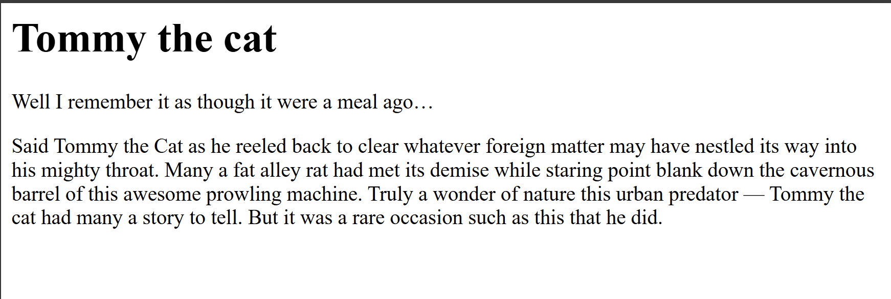
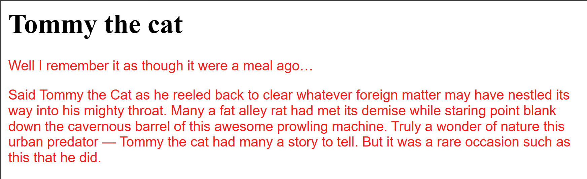
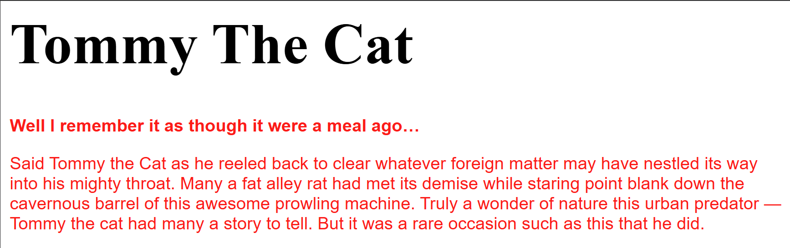
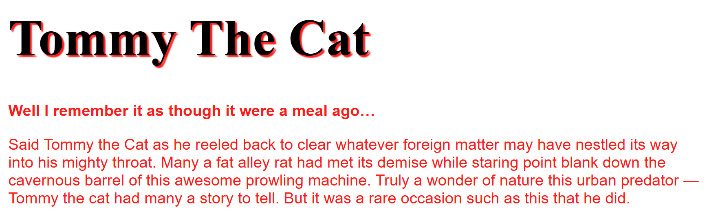
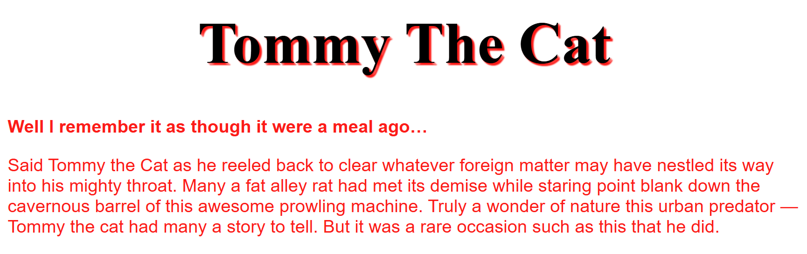
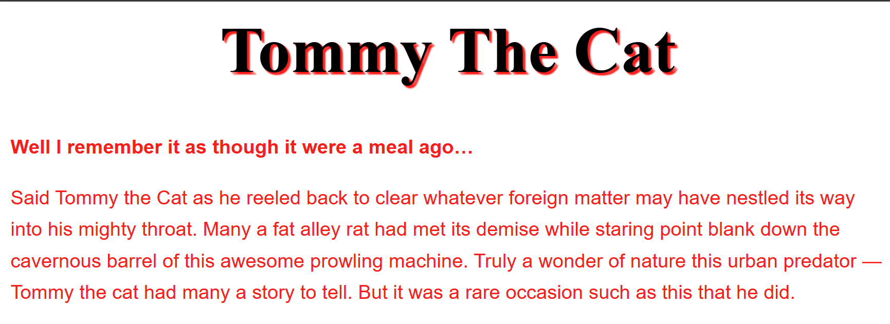

# Fundamental text and font styling

## Before adding any style

## Adding font color & font family

## Adding font size & text transform 

## Adding some text shadow 

## Adding text align to header

## Adding line-height for better reading

